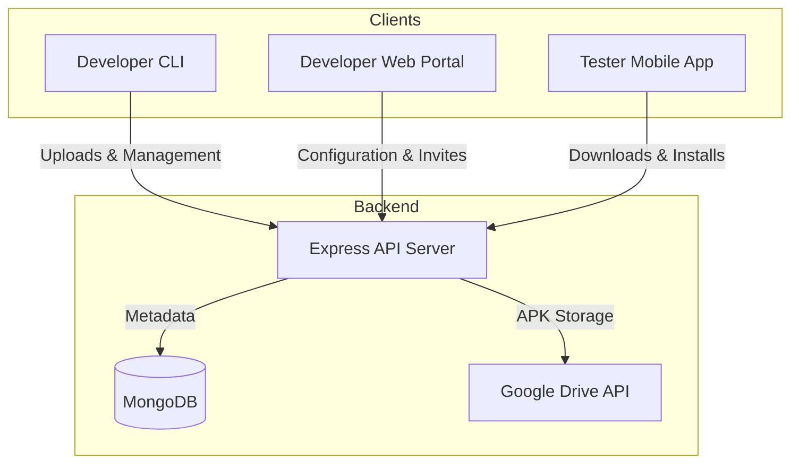

# TestAPK - APK Release Manager for Testers

TestAPK is an end-to-end platform designed to simplify the distribution of Android APK builds from developers to testers. The platform provides a secure, self-hosted backend, a web dashboard, a developer CLI tool, and a mobile application for testers.

---

## System Architecture



---

## Component Overview

The repository is organized into four main components:

### 1. [Server](./server)
The backend API server built with Node.js, TypeScript, and Express.
- **Key Features**: Google OAuth authentication, MongoDB database management, tester invitation system, and secure Google Drive integration for APK storage.
- **Technologies**: Express, Mongoose, Google APIs, Zod, Helmet.

### 2. [Webapp](./webapp)
The developer web portal built with React and Vite.
- **Key Features**: Google Sign-In, application management dashboard, Google Drive integration setup, tester invitation management, and CLI device authorization flow.
- **Technologies**: React, Vite, Vanilla CSS (Glassmorphic UI), Lucide Icons.

### 3. [CLI](./cli)
A command-line interface tool for developers to interact with the platform.
- **Key Features**: Device authorization flow (CLI login), application listing, application creation, and direct APK uploading.
- **Technologies**: Node.js, Commander.js.

### 4. [Flutterapp](./flutterapp)
The tester mobile application built with Flutter.
- **Key Features**: Google Sign-In, application list (with invitation accept/decline), release history, detailed build specifications, and direct in-app APK downloading and installation.
- **Technologies**: Flutter, Dart, Google Sign-In, Open Filex, Permission Handler.

---

## Quick Start Guide

### Prerequisites
- **Node.js** (v18 or higher)
- **Flutter SDK** (v3.12.2 or higher)
- **MongoDB** (local instance or MongoDB Atlas)
- **Google Cloud Console Project** with Google Drive API enabled and OAuth 2.0 credentials.

### Setup Steps

1. **Clone the Repository**:
   ```bash
   git clone <repository-url>
   cd testapk
   ```

2. **Start the Database**:
   Ensure MongoDB is running locally or have your MongoDB Atlas URI ready.

3. **Configure and Run the Server**:
   ```bash
   cd server
   cp .env.example .env
   # Edit .env with your MongoDB URI and Google OAuth credentials
   npm install
   npm run dev
   ```

4. **Configure and Run the Webapp**:
   ```bash
   cd ../webapp
   cp .env.example .env
   # Edit .env with your VITE_API_URL and VITE_GOOGLE_CLIENT_ID
   npm install
   npm run dev
   ```

5. **Configure and Run the Flutterapp**:
   - Open `flutterapp/lib/core/constants.dart`.
   - Update `kApiBaseUrl` to point to your server (e.g., `http://10.0.2.2:3000/api/v1` for the Android emulator).
   - Update `kGoogleClientId` with your Google OAuth Client ID.
   - Run the app:
     ```bash
     cd ../flutterapp
     flutter pub get
     flutter run
     ```

6. **Install and Use the CLI**:
   ```bash
   cd ../cli
   npm install
   npm link # Optional: links 'testapk' command globally
   node index.js login
   ```
